# Documentation of Project-2

## Installing the nginx web server

`sudo apt update`

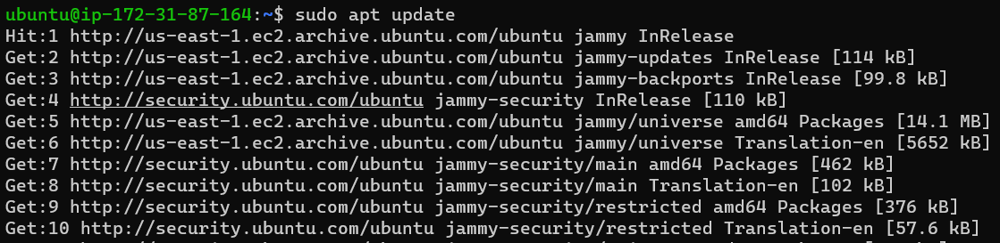

### Installing Nginx

`sudo apt install nginx`

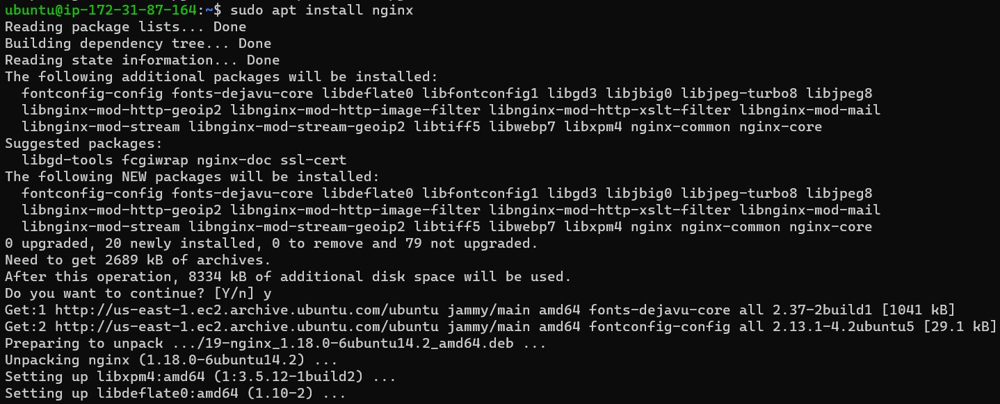

### To verify that nginx was successfully installed and is running as a service in Ubuntu

`sudo systemctl status nginx`

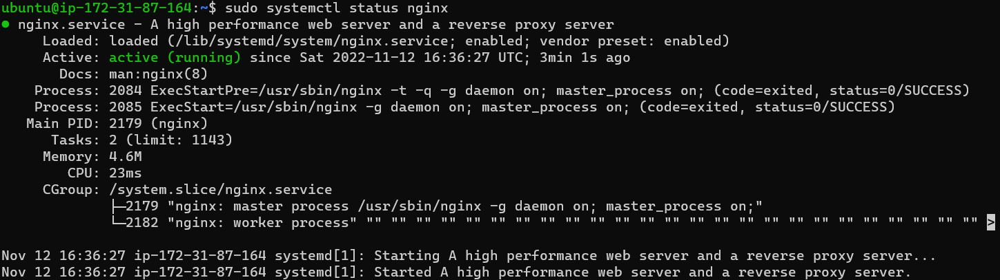

### With EC2 configuration open to inbound connection through port 80, server is being accessed locally in Ubuntu shell:

`curl http://localhost:80`

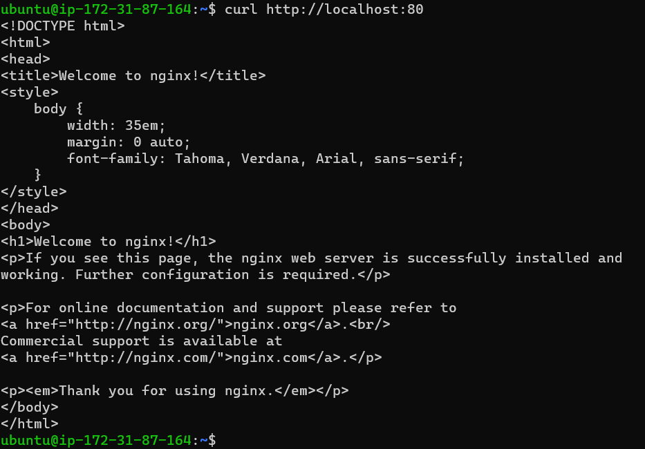

### Accessing web server over the internet using public IP

[url with public IP](http://54.209.203.146:80)

### Before webserver was accessed over the internet, Public IP address was retrieved without accessing AWS console, using command:

`curl -s http://169.254.169.254/latest/meta-data/public-ipv4`

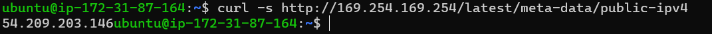

## Installing mysql

### installing mysql using apt

`sudo apt install mysql-server`

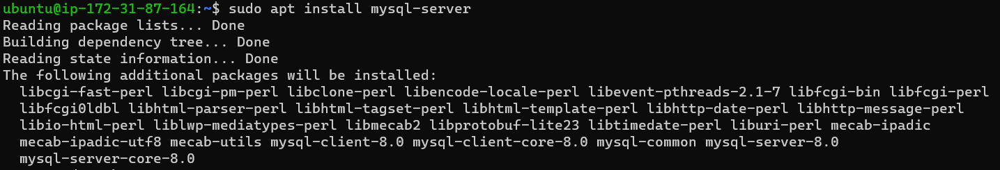

### Logging into mysql console

`sudo mysql`

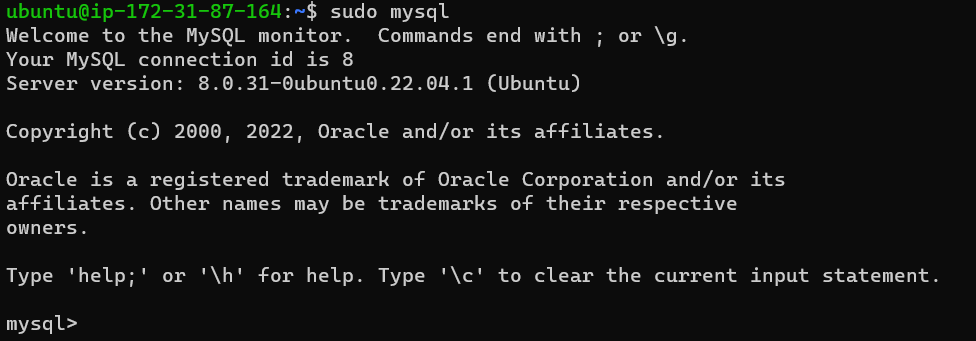

### setting a password for the root user, using mysql_native_password as default authentication method

`ALTER USER 'root'@'localhost' IDENTIFIED WITH mysql_native_password BY '******';`

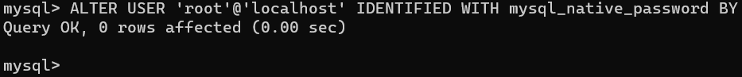

### Exiting mysql console

`exit`

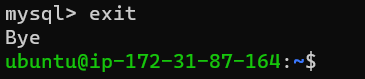

### Running interactive security script to lockdown access on database

`sudo mysql_secure_installation`

### A strong mysql_native_password was maintained!

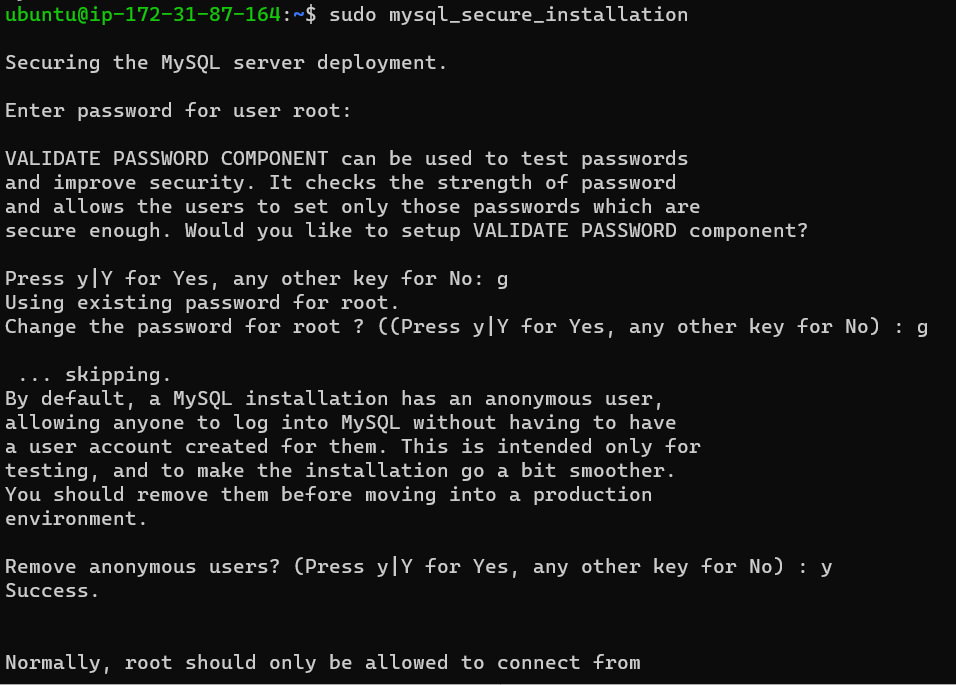

### Testing logon access to mysql console

`sudo mysql -p`

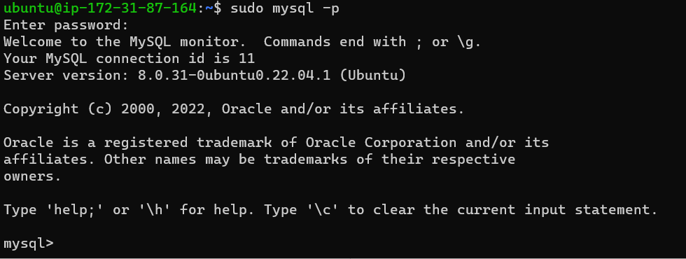

### Exiting mysql console again:

`exit`

